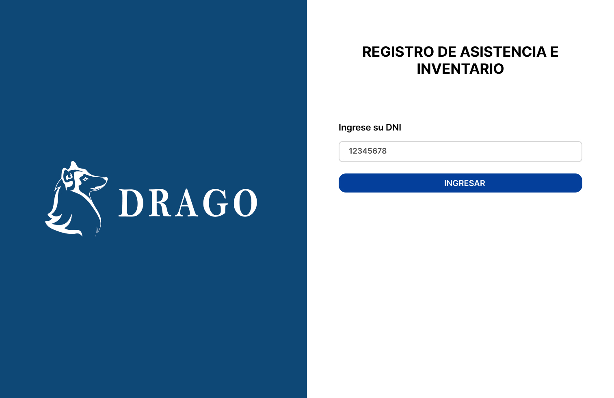

# Sistema de Control de Asistencia e Inventario DRAGO


Este sistema es una solución a un problema de la empresa Drago, desarrollado con el objetivo de aplicar los conceptos aprendidos en el curso de Introducción a las TIC.

## Clonar el Repositorio

Para clonar el repositorio en su computadora, debe seguir los siguientes pasos:

**Clonar el repositorio con Git:**
```bash
  git clone https://github.com/Jamesllm/drago-asistencia
```

Si no tiene instalado Git en su computadora, puede descargar el proyecto haciendo clic en el botón **Code** y luego en **Download ZIP**.


## Crear Base de Datos en PostgreSQL

Para iniciar, cree la base de datos con el nombre ```drago_registro```. 


Después de haber creado la base de datos, procedemos a generar las tablas correspondientes, nombradas ```usuarios``` y ```r_asistencia```, mediante **CREATE Script**. Posteriormente, realizamos la inserción de valores con el propósito de llevar a cabo pruebas.


El código SQL lo encontrará en la carpeta ```/backend/database.sql```.

## Ejecutar el Servidor

Para ejecutar el servidor necesita situarse en la carpeta ```/backend```.

Después instale las dependencias con:
```bash
 cd backend
 yarn install
```
Esto instalará los complementos necesarios para el correcto funcionamiento del servidor.

Antes de correr el servidor necesita hacer un cambio en el archivo de variables de entorno ```.env```, específicamente en ```IP_PORT``` que tendrá que ser cambiado por su IP, tambien ```DB_PASS``` y ```DB_HOS```. El archivo ```.env``` lo encontrará en ```/backend/.env```.

Después de instalar las dependencias y cambiar el valor de ```IP_PORT``` ejecutará el siguiente script para correr el servidor:
```bash
 yarn start
```

Con eso, el servidor estará corriendo en 
```bash
 localhost:3004
```

## Ejecutar el FrontEnd

Para correr el frontend, es prácticamente lo mismo que el backend. Debe situarse en la carpeta ```/frontend```.

Después instale las dependencias con:
```bash
 cd frontend
 yarn install
```
Esto instalará los complementos necesarios para el correcto funcionamiento del frontend.

Después de instalar las dependencias ejecutará el siguiente script para correr el frontend:
```bash
 yarn start
```

Con eso, el frontend estará corriendo en 
```bash
 localhost:3000
```